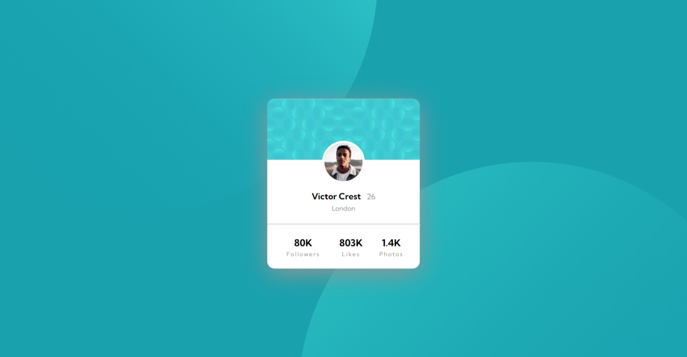

# Frontend Mentor - Profile card component

## 1. Overview

The challenge is to build out this profile card component and get it looking as close to the design as possible.


### a) My screenshot



### b) Links

- Solution URL: [my source code here](https://github.com/hieutrantrong21520859MMCL21/FrontEndPractice_Intern_ProfileCardComponent)
- Live Site URL: [my website's URL here](https://hieutrantrong21520859mmcl21.github.io/FrontEndPractice_Intern_ProfileCardComponent/)

## 2. My process

### a) Built with

- Semantic HTML5 markup
- CSS custom properties
- Flexbox and its some attributes (flex-direction, align-items)
- [Styled Components](https://styled-components.com/) - For styles

### b) What I learned

- How to create a table using HTML tags.
- How to use <span> tag.
- Some codes I am most proud of (which consist of knowledge I have learned):

```html
<p>
      <span style="font-size: 18px; font-weight: 700;">
        Victor Crest
      </span>&nbsp;
      <span style="color: hsl(0, 0%, 59%);">
        26
      </span>
</p>
```

```html
<table style="width: 80%; margin-top: 25px; margin-left: auto; margin-right: auto; text-align: center;">
      <tr style="font-size: 18px;">
          <th>80K</th>
          <th>803K</th>
          <th>1.4K</th>
        </tr>
      <tr style="font-size: 12px; letter-spacing: 2px; color: hsl(0, 0%, 59%);">
          <td>Followers</td>
          <td>Likes</td>
          <td>Photos</td>
      </tr>
    </table>
```

### c) Useful resources

- [MDN - HTML](https://developer.mozilla.org/en-US/docs/Web/HTML): this helped me a lot about HTML via articles.
- [Learn HTML](https://web.dev/learn/html): this is an amazing website that provides lessons about HTML with examples.
- [MDN - CSS](https://developer.mozilla.org/en-US/docs/Web/CSS): this helped me well with CSS via articles.
- [Learn CSS](https://web.dev/learn/css): this is an amazing website that provides lessons about CSS with examples.